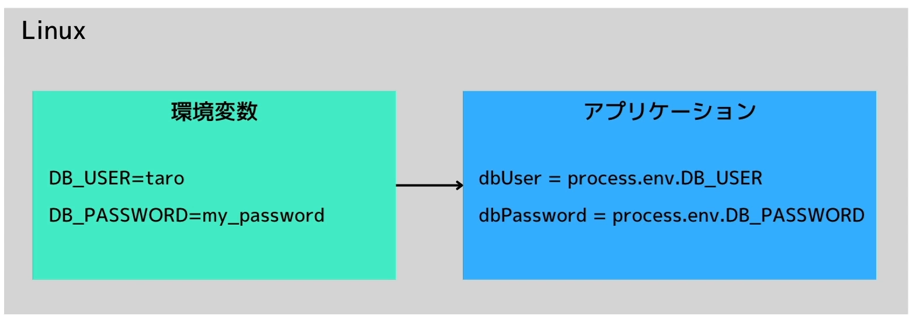

# 環境変数
## 環境変数とは
システム全体の特定のアプリケーションに関する設定情報を保持する変数。  
一時的な情報のため、ターミナルを閉じると削除されてしまう。 


## コマンド
```terminal
printtenv 確認したい環境変数
echo $確認したい環境変数

例： printenv PATH
　　 echo $PATH
```

## 新しい環境変数の設定方法
```terminal
export ショートカットコマンド="元のショートカット"

例： export MY_VARIABLE="Hello World"
```

## 設定した環境変数の削除方法
```terminal
unset 環境変数名

例： unset MY_VARIABLE
```


## メリット
環境変数の値をアプリケーション側に埋め込む必要がなく、開発環境が変更になった時に毎回変更する必要がなく管理が楽になる。