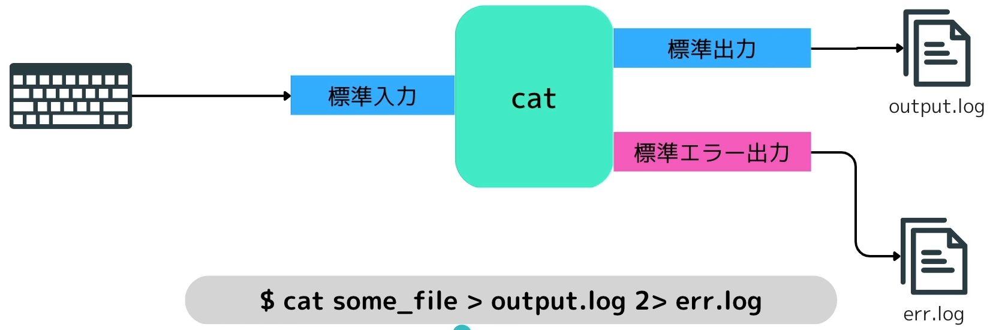
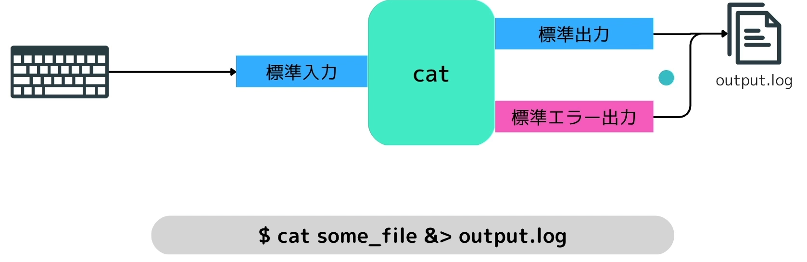
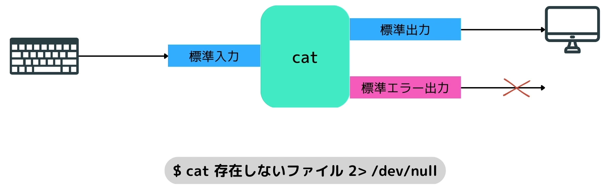

# 複雑なリダイレクト
## 標準出力と標準エラー出力を別々にリダイレクトする
```terminal
cat some_file > output.log 2> err.log
```
上記のコマンドを実行すると画像の通り、状況に応じてにリダイレクトされる。


## 標準出力と標準エラー出力を一つのファイルにリダイレクトする
```terminal
cat some_file &> output.log
```

標準出力と標準エラー出力を一つのファイルに出力することが出来る。


## 特定の出力結果をどこにも出力させない
```terminal
cat 存在しないファイル 2> /dev/null
```

上記の通り存在しないファイルを指定しても、出力先を/dev/nullにすることでその内容をどこにも出力させないことが出来る。
厳密には出力はされるが、同時に削除されるため何も出力されないという流れになる。