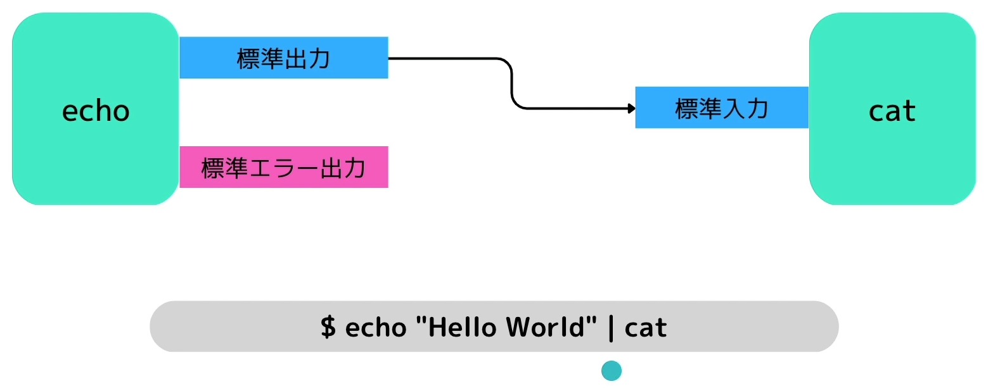

# パイプ
## パイプとは
あるコマンドの出力を別のコマンドの標準出力に流すことが出来る。  
パイプによって複雑なコマンドを実行できるようになる。
```terminal
echo "Hello World" | cat
```



## パイプとgrepの組み合わせ（頻出）
パイプをgrepを組み合わせることによって、特定のフォルダの特定のファイルを出力させることが出来る。
```terminal
lsコマンドで一覧を取得し、「bash」で絞込検索を行う。
ls -a | grep bash
```