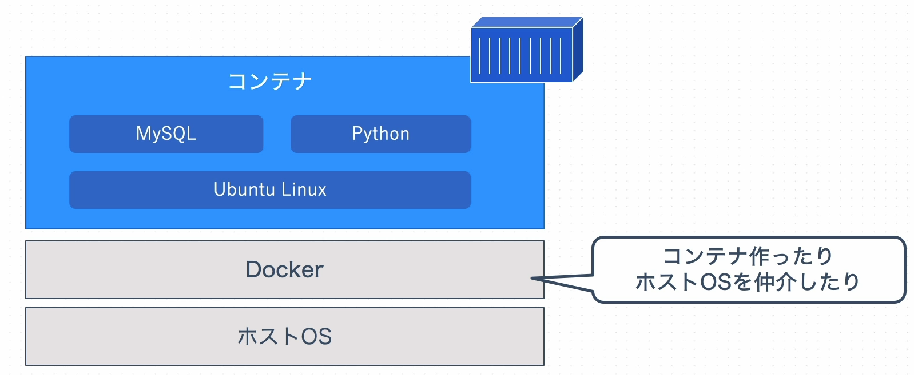
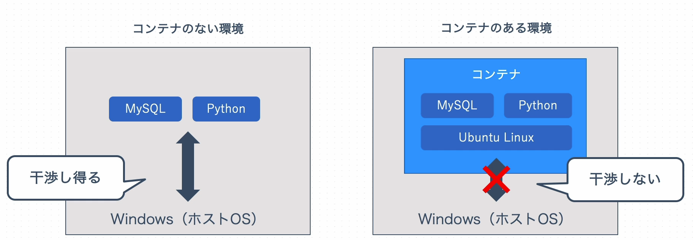

# **Dockerとは何か？**
## **Dockerとは？**
コンテナ仮想化技術を使って、アプリケーションを開発・配置・実行するための隔離された環境を提供するツールのこと。

## **コンテナとは？**
パソコンやサーバ上で隔離され、干渉されない環境のこと。  
コンテナにソフトウェアをインストールすることで他の環境に干渉されない環境を作ることが出来る。ソフトウェアならなんでも入れることが可能。  
コンテナの中に小さなパソコンがあるイメージ。    
コンテナは単体では動くことが出来ず、ホストマシン（ホストOS）が必要。

例えば、下記の環境で開発したい場合
- Ubuntu Linux
- Python
- MySQL

コンテナなら一括で再現することが出来る。  

## コンテナ環境があるときとないときの違い
コンテナを使用しない場合だとソフトウェアをホストマシンに直接ダウンロードする必要があり、OSとソフトウェア同士やソフトウェアのバージョンなどの干渉や副作用を起こす可能性がある。  
コンテナ環境だと、ホストマシンと隔離されている環境のため干渉や副作用を未然に防ぐことが出来る。    

## 使用教材、参考サイトなど
- [理解して使う！Docker入門＋応用：初心者から実務で使えるスキルが身に付ける](https://www.udemy.com/course/ok-docker/?couponCode=KEEPLEARNING)

## 終わりに
何か誤り等あればコメントにて教えていただけると幸いです。