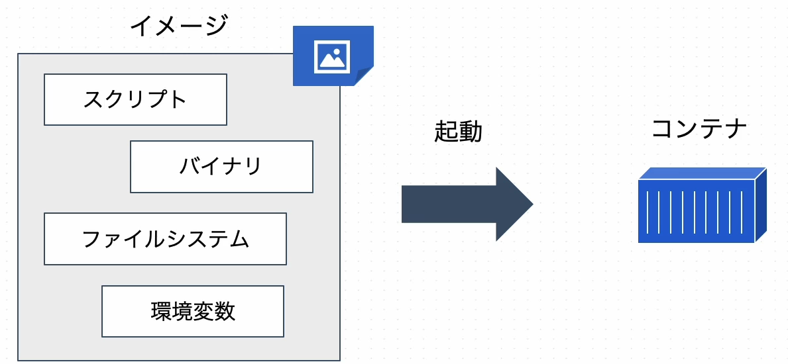
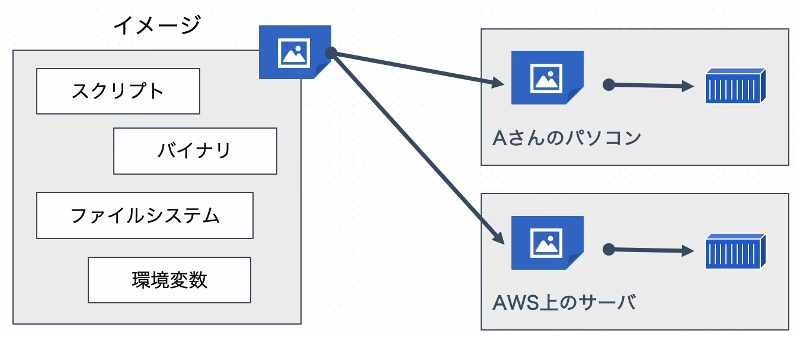

# Dockerイメージとは？
## **Dockerイメージとは？**
コンテナに必要なソフトウェアや、環境変数、設定などが情報として入っているもの。  
コンテナがどういった環境なのかを定義する**実行環境テンプレート**の役割。
  
  
## **配布、コンテナ環境の再現が可能**
イメージは、変更不可な静的テンプレートであるため、どの環境で実行しても同じコンテナ環境が再現できる。  
