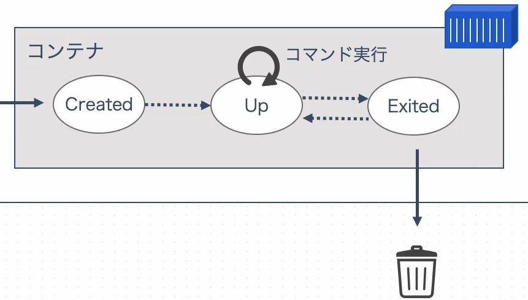

# イメージとコンテナのライフサイクル
## **Dockerイメージの作成方法**
1. [Docker Hub](https://www.docker.com/ja-jp/products/docker-hub/)のような様々なイメージを格納している、イメージレジストリから取得する。
2. **Dockerfile**を使用して、自分好みにカスタムしたイメージを使用する。

## **Docker Hubとは**
Dockerイメージを登録・配布を可能なサイト。  
Dockerfileで特に指定しない場合は、Docker Hubからベースイメージがダウンロードらされる。

## **イメージとコンテナのライフサイクル**
イメージから作成されたコンテナは「**Created**」という状態になり、作成されいているだけで実行はされていない。  
起動をするとCreatedから「**Up**」という状態に遷移する。この状態ではじめてコマンドを実行することが出来る。  
実行したコマンドが実行すると「**Exited**」という状態になる。この状態から再度Upにしたり破棄することも可能。
