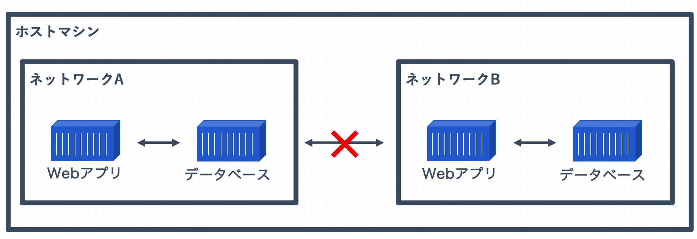

# **コンテナと接続する**
## ホストとコンテナのポートを紐づける
```terminal
docker container run -p {ホスト側のポート}:{コンテナ側のポート} {イメージ}
```

## Dockerネットワークとは
コンテナ同士の通信を簡単にしたり、不要なコンテナ同士の通信を防ぐために隔離する。


### ネットワークの一覧を表示する
```terminal
docker network ls
```

## ブリッジネットワークとは
複数のコンテナの通信の橋渡しの役割を持つネットワークのこと。  
自分でカスタムしたネットワークを作成することが出来る。

### ネットワークの詳細情報を表示する
```terminal
docker network inspect {ネットワーク名}
```

### 新しいネットワークを作成する
```terminal
docker network create {ネットワーク名}
```

### 指定したネットワークに接続したコンテナを起動する
```terminal
docker container run --network {ネットワーク名} {イメージ名}
```

### ネットワークを削除する
```terminal
docker network rm {ネットワーク名}
```